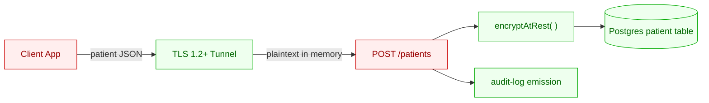

# data-flow-tracer

## Procedure

1. For each file in `files_touched`, parse it (read with `read_file`) and identify:
   - **Sources** of ePHI: HTTP request bodies, file reads, queue receivers, DB reads.
   - **Sinks**: DB writes, HTTP response bodies, log lines, outbound HTTP calls, file writes.
   - **Transforms**: encrypt / decrypt / hash / anonymize / serialize calls.
2. Build a directed graph from sources → transforms → sinks.
3. Color-code:
   - 🔴 red: ePHI present in plaintext at this node
   - 🟡 yellow: ePHI present but only briefly in memory
   - 🟢 green: ePHI encrypted at this node
4. Render as Mermaid `graph LR` to `compliance/evidence/PR-{n}/data-flow.mmd`.
5. Run `mmdc -i data-flow.mmd -o data-flow.png` to render the PNG.

## Mermaid template

## Output requirements

- The diagram must show every file in `files_touched`.
- Each ePHI field that appears at any node must be labeled on its source edge.
- If an unencrypted DB write is detected, the edge to the DB node MUST be red and labeled with the control violation: `❌ §164.312(a)(2)(iv)`.
- If a plain-HTTP sink is detected, the edge MUST be red with `❌ §164.312(e)(1)`.

## Notes

- Mermaid is sufficient — do not invest time in d2 or graphviz; PDF rendering will use the PNG.
- If the file content is genuinely too complex to trace cleanly, output a simplified diagram with one node per file and add a note in `threat-delta.md` flagging the simplification.
